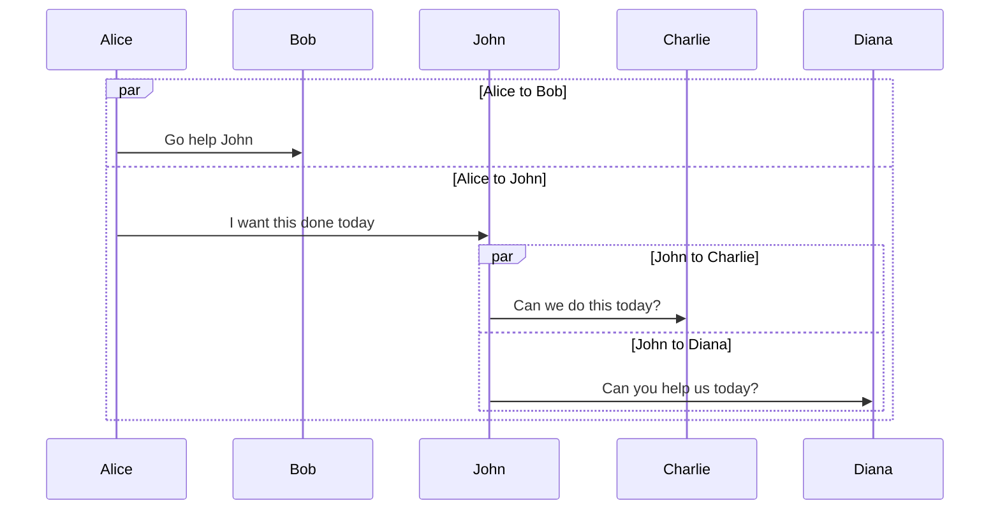

# here's one thing
## Here's thing two
### Mermaid markdown

```mermaid
graph TD;
    A-->B;
    A-->C;
    B-->D;
    C-->D;
```

### Mermaid sequence diagram

```mermaid
sequenceDiagram
    par Alice to Bob
        Alice->>Bob: Go help John
    and Alice to John
        Alice->>John: I want this done today
        par John to Charlie
            John->>Charlie: Can we do this today?
        and John to Diana
            John->>Diana: Can you help us today?
        end
    end
```